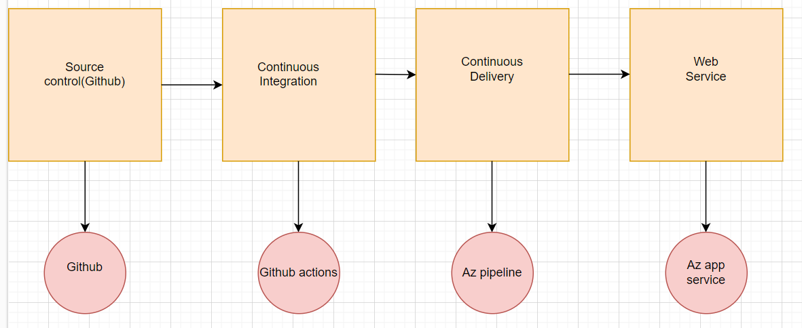
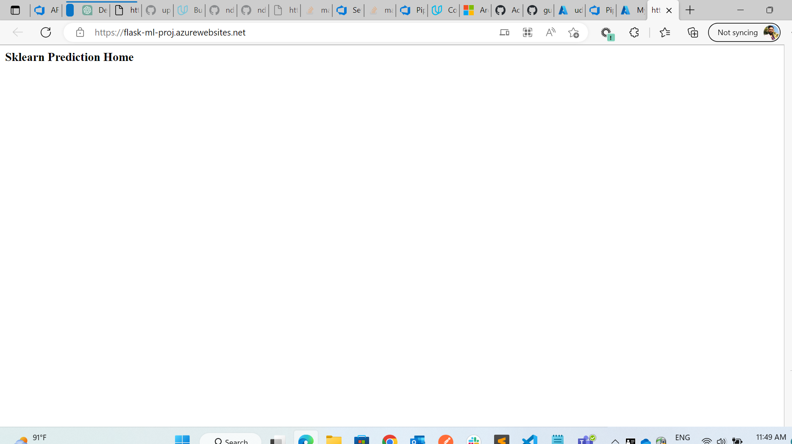
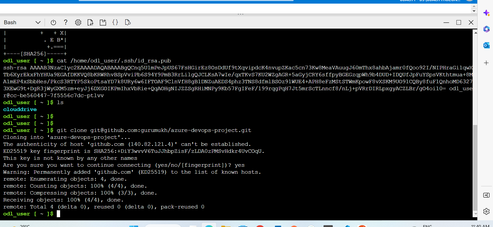
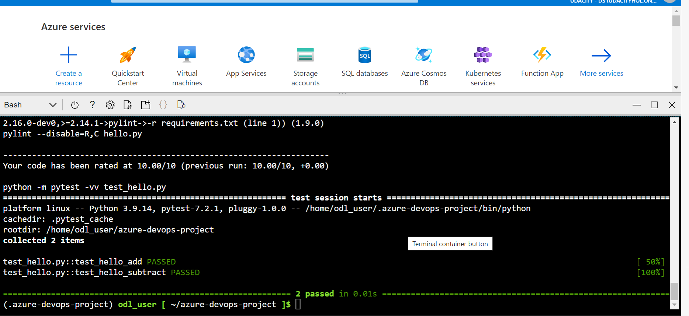
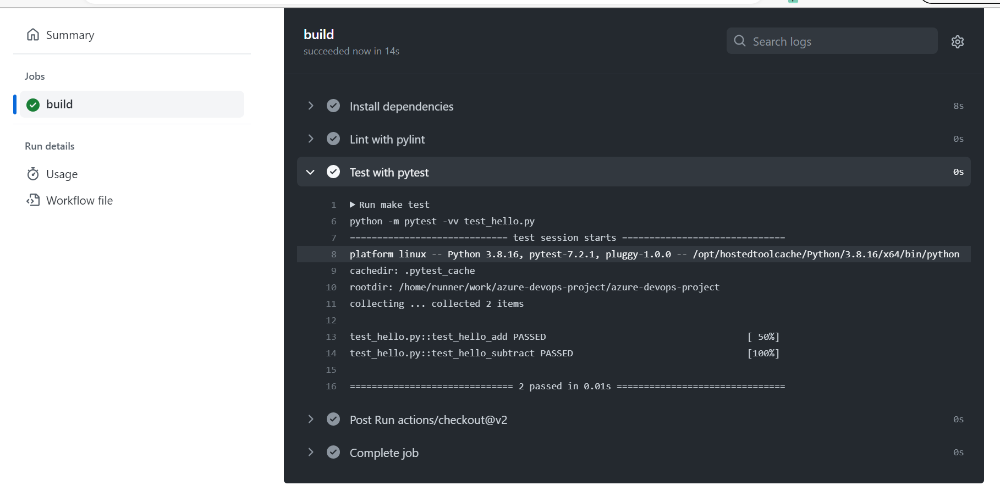
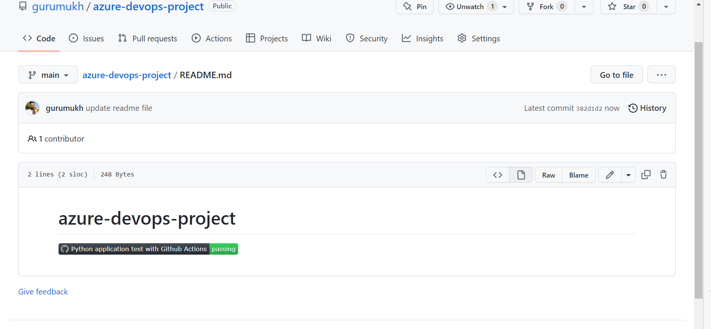
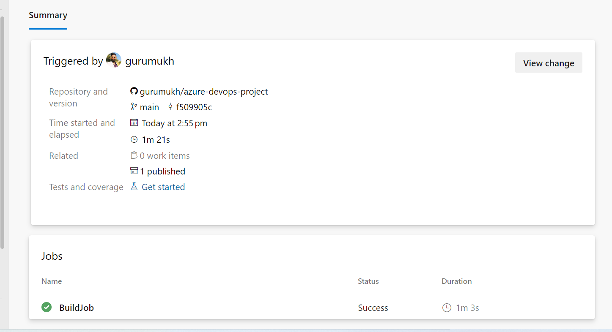
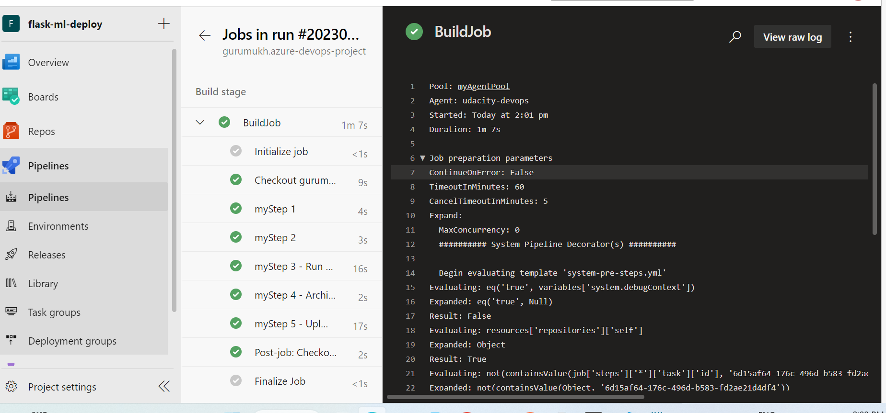
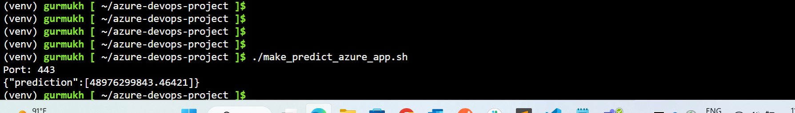

# Overview

In this project we send data as input for a machine learning model to predict the price of a house.
Example:
These are parameters we are sending to machine learning model 
`{  
   "CHAS":{  
      "0":0
   },
   "RM":{  
      "0":6.575
   },
   "TAX":{  
      "0":296.0
   },
   "PTRATIO":{  
      "0":15.3
   },
   "B":{  
      "0":396.9
   },
   "LSTAT":{  
      "0":4.98
   }`
These features are used as input for a machine learning model to predict the price of a house.

## Project Plan

* A link to a Trello board for the project
* A link to a spreadsheet that includes the original and final project plan>

## Instructions

* Architectural Diagram (Shows how key parts of the system work)
 

* Explanation of components

The architecture consists of an Azure Pipeline service that initiates the build and deployment process, and communicates with a self-hosted agent that is running on a user-managed machine. The self-hosted agent is responsible for executing the build and test steps, as well as deploying the application to the target environment.

The source control system is where the application's source code is stored, and is integrated with the Azure Pipeline service to trigger the build and deployment process. The build and test environment is where the application is built and tested, and is also integrated with the Azure Pipeline service to provide feedback on the build and test results.

 * Instructions for running the Python project.  How could a user with no context run this project without asking you for any help.  Include screenshots with explicit steps to create that work. Be sure to at least include the following screenshots:

* Project running on Azure App Service

* Project cloned into Azure Cloud Shell

* Passing tests that are displayed after running the `make all` command from the `Makefile`

* Output of a test run

* Successful deploy of the project in Azure Pipelines.  [Note the official documentation should be referred to and double checked as you setup CI/CD](https://docs.microsoft.com/en-us/azure/devops/pipelines/ecosystems/python-webapp?view=azure-devops).

* Running Azure App Service from Azure Pipelines automatic deployment

* Successful prediction from deployed flask app in Azure Cloud Shell.  [Use this file as a template for the deployed prediction](https://github.com/udacity/nd082-Azure-Cloud-DevOps-Starter-Code/blob/master/C2-AgileDevelopmentwithAzure/project/starter_files/flask-sklearn/make_predict_azure_app.sh).
The output should look similar to this:

* Output of streamed log files from deployed application
`
[
  {
    "details_url": null,
    "id": "7aad019a-b3ec-46c8-98d0-fecf0c06addd",
    "log_time": "2023-02-17T02:07:41.7158907Z",
    "message": "Updating submodules.",
    "type": 0
  },
  {
    "details_url": null,
    "id": "7d5e9826-babf-4e3c-a846-de5abe6275bf",
    "log_time": "2023-02-17T02:07:42.9787764Z",
    "message": "Preparing deployment for commit id '4b388b97-f'.",
    "type": 0
  },
  {
    "details_url": null,
    "id": "bcdb1ade-e1da-4e5b-9df5-497cbc93f4a2",
    "log_time": "2023-02-17T02:07:43.6706595Z",
    "message": "PreDeployment: context.CleanOutputPath False",
    "type": 0
  },
  {
    "details_url": null,
    "id": "635a5c19-31e1-4db9-b38c-eff3951bb555",
    "log_time": "2023-02-17T02:07:43.8250572Z",
    "message": "PreDeployment: context.OutputPath /home/site/wwwroot",
    "type": 0
  },
  {
    "details_url": null,
    "id": "f161dbc4-20c9-451e-9fa1-7bf9c18977bd",
    "log_time": "2023-02-17T02:07:44.0819044Z",
    "message": "Repository path is /tmp/zipdeploy/extracted",
    "type": 0
  },
  {
    "details_url": "https://flask-ml-proj.scm.azurewebsites.net/api/deployments/4b388b97-f2ad-44a5-b0ae-244f84ed5d46/log/618a5104-df40-4a7c-97d7-1f3f42bfe8a7",
    "id": "618a5104-df40-4a7c-97d7-1f3f42bfe8a7",
    "log_time": "2023-02-17T02:07:44.251366Z",
    "message": "Running oryx build...",
    "type": 0
  },
  {
    "details_url": null,
    "id": "407edc90-853f-4e63-926e-67350644a9ab",
    "log_time": "2023-02-17T02:09:06.2654496Z",
    "message": "Running post deployment command(s)...",
    "type": 0
  },
  {
    "details_url": null,
    "id": "8ce76d87-4d49-4b46-b975-59451aeff8f0",
    "log_time": "2023-02-17T02:09:06.4088772Z",
    "message": "",
    "type": 0
  },
  {
    "details_url": null,
    "id": "4439bafb-7a5b-4e11-8a74-a29b15ea0532",
    "log_time": "2023-02-17T02:09:06.5493062Z",
    "message": "Generating summary of Oryx build",
    "type": 0
  },
  {
    "details_url": null,
    "id": "013866a5-6f65-4323-9be5-dd41f60de84d",
    "log_time": "2023-02-17T02:09:07.0097775Z",
    "message": "Parsing the build logs",
    "type": 0
  },
  {
    "details_url": null,
    "id": "60d3b77c-2f9a-48e9-92e2-22282e1ee2c4",
    "log_time": "2023-02-17T02:09:07.222479Z",
    "message": "Found 0 issue(s)",
    "type": 0
  },
  {
    "details_url": null,
    "id": "35be3b14-dd61-4463-96c4-a97be32e6507",
    "log_time": "2023-02-17T02:09:07.3477644Z",
    "message": "",
    "type": 0
  },
  {
    "details_url": null,
    "id": "bd70dd9d-9f5c-4df8-b387-bb2c8a24cd62",
    "log_time": "2023-02-17T02:09:07.4658742Z",
    "message": "Build Summary :",
    "type": 0
  },
  {
    "details_url": null,
    "id": "13689c74-879f-43f2-8ecd-7a81225b9712",
    "log_time": "2023-02-17T02:09:07.6010781Z",
    "message": "===============",
    "type": 0
  },
  {
    "details_url": null,
    "id": "7d5d2096-9e5c-4c7e-b55d-1f5988e723fc",
    "log_time": "2023-02-17T02:09:07.7202427Z",
    "message": "Errors (0)",
    "type": 0
  },
  {
    "details_url": null,
    "id": "0e34da33-0349-4c3e-aad1-fc758d1d612c",
    "log_time": "2023-02-17T02:09:07.8488593Z",
    "message": "Warnings (0)",
    "type": 0
  },
  {
    "details_url": null,
    "id": "100294a7-2ff3-489f-89b1-fab9f0ee0d9c",
    "log_time": "2023-02-17T02:09:08.0150763Z",
    "message": "",
    "type": 0
  },
  {
    "details_url": null,
    "id": "8ccd113a-2ec7-4bc6-8f34-1077e5684775",
    "log_time": "2023-02-17T02:09:08.2443161Z",
    "message": "Triggering recycle (preview mode disabled).",
    "type": 0
  },
  {
    "details_url": null,
    "id": "e1f612f8-0e3d-4788-9cee-9e88ad159920",
    "log_time": "2023-02-17T02:09:08.4436758Z",
    "message": "Deployment successful. deployer = Push-Deployer deploymentPath = ZipDeploy. Extract zip. Remote build.",
    "type": 0
  }
]`

## Enhancements

Here are some additional features that we can  consider adding to our project to improve the accuracy of our house price predictions:

* Property characteristics: we could consider including additional features that describe the physical characteristics of the property, such as the number of bedrooms, bathrooms, square footage, lot size, or age of the property.

* Location features: We could include location-based features, e.g. schools, parks, mall), crime rates, and other neighborhood features that might affect property values.

## Demo 

<TODO: Add link Screencast on YouTube>
